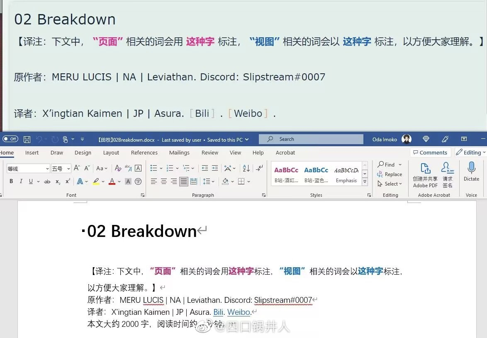
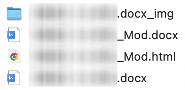
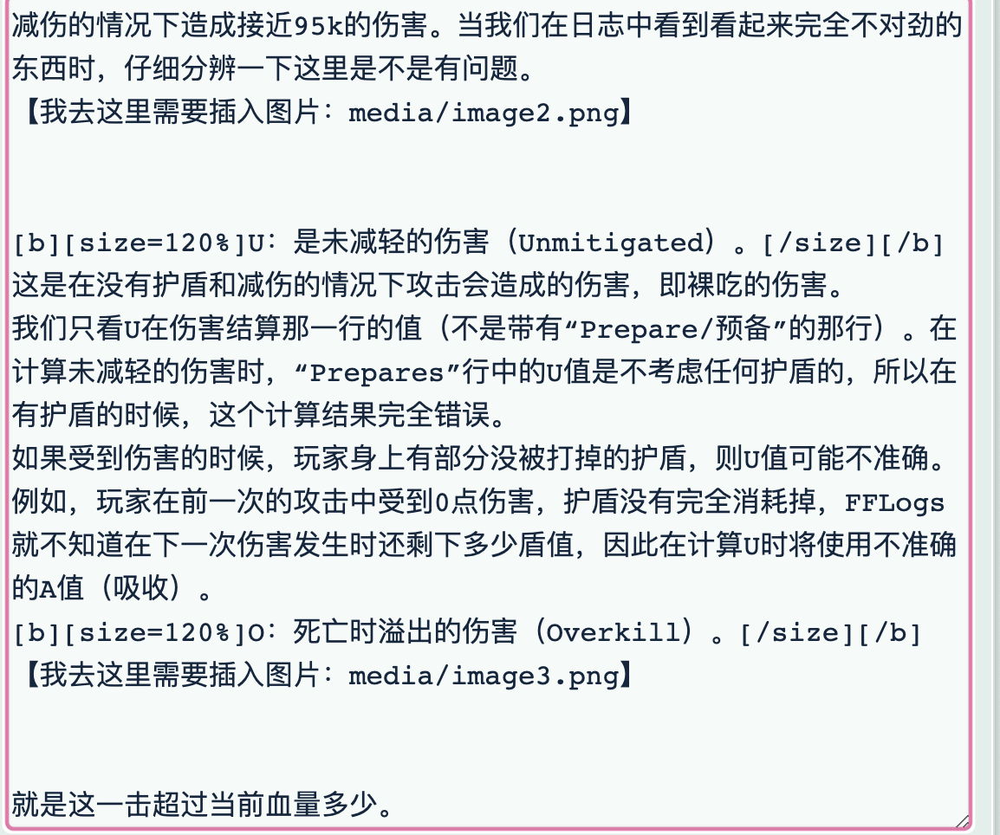

# WordToNga

一款直接将 Word 文档转换为 Nga 发帖格式的python小工具。

- **支持**样式

- **支持**颜色

- **支持**加粗

- **支持**无序列表

- 半支持图片，需要手动粘贴。
    - 有谁告诉我怎么自动上传到nga服务器？？

- 不支持表格

# 使用说明

## 安装依赖包

clone 后，在根目录打开终端，输入

`pip install -r requirements.txt -i -r https://pypi.tuna.tsinghua.edu.cn/simple`

## 工具命令行

`python src/client_main.py -i path/to/doc`

`path/to/doc`为指向目标 doc 文档的相对或绝对路径。

执行后，该工具会在`path/to/doc`同目录下生成

- 带有 Mod 后缀的 doc 文档

- 带有 Mod 后缀的 html 文件

- 带有 img 后缀的文件夹

如图所示，最后一个文件是原 doc 文件。

## 导出到 Nga

使用浏览器打开 html 文件，全选并复制，粘贴至 Nga 发帖框即可。

关于图片：打开上图中`img`后缀的文件夹，里面的`word/media`文件夹中包含所有需要的图片。

在 Nga 的发帖框中，如果看到有大段空白处，那就是刻意留出、需要手动粘贴图片的地方。

最后，不要忘了使用预览检查发帖格式。

# 新需求？Issue 随便提
